# Hi 👋, I'm Alexandre Ribeiro!

🎓 **Computer Science student (UNIFACS) · Salvador, Brazil**

🐍 I build **data pipelines, ML models and Python APIs** that solve real problems, from ocean data dashboards to AI agents for customer support.

---

## 🌐 Where to find me

  
  
  

---

## 🚀 Featured projects

| Project | What it does | Stack |
|---|---|---|
| 🌊 [**Salvador Ocean Dashboard**](https://github.com/AlexandreRibeiro1/painel-oceano-salvador) · [live](https://alexandreribeiro1.github.io/painel-oceano-salvador/) | Collects sea temperature, waves, tides and beach water quality from 3 public sources (API, NOAA satellite data, scraped PDFs) and republishes a map-based dashboard every 3 hours | Python · FastAPI · SQLAlchemy · GitHub Actions |
| 🤖 [**AI Support Triage Agent**](https://github.com/AlexandreRibeiro1/agente-triagem-suporte-ia) | Classifies ticket urgency and answers FAQ questions with local retrieval (RAG); models evaluated with cross-validation, baseline and threshold sweep | Python · scikit-learn · pandas · pytest |
| 🧭 [**Resume × Job Matcher**](https://github.com/AlexandreRibeiro1/resume-job-matcher) | Compares a résumé with a job posting using skill matching plus TF-IDF or multilingual embeddings, and suggests what to improve | Python · Streamlit · scikit-learn · sentence-transformers |
| 📡 [**Internship Job Monitor**](https://github.com/AlexandreRibeiro1/monitor-estagio-ti) | Scrapes job boards, filters and deduplicates postings, and notifies only new ones via Telegram, with a web dashboard | Python · FastAPI · SQLite · BeautifulSoup |

---

## 🧠 What I do

- 📊 **Data pipelines:** collecting data from APIs, scraping and PDFs, cleaning it and storing it in SQL
- 🤖 **Machine learning & NLP:** text classification, similarity search, embeddings and RAG, with proper evaluation (cross-validation, baselines, confusion matrices)
- 🔌 **APIs & dashboards:** FastAPI backends and Streamlit or vanilla JS front ends
- ✅ **Tested, automated projects:** pytest and GitHub Actions for CI and scheduled data updates
- 💻 Also comfortable with Java and JavaScript

---

## 🛠️ Tech Stack

### Languages

### Data & Machine Learning

### Backend & Databases

### Frontend

### DevOps & Tools

---

## 📊 GitHub Stats

  
  

